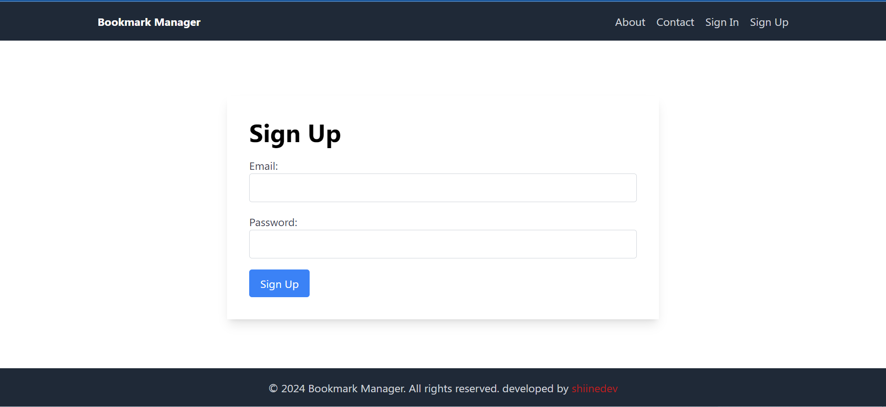

# Bookmark Manager

A web application to manage bookmarks using React.js, Tailwind CSS, and Firebase.

## Features

- User Authentication (Sign In and Sign Up)
- Add, Update, Delete, and Pin Bookmarks
- Responsive Design
- User-specific bookmarks

## Technologies Used

- **React**: A JavaScript library for building user interfaces.
- **Firebase**:
  - **Authentication**: For user sign-up and login.
  - **Firestore**: For storing and managing Bookmars.
  - **index**: For sorting the bookmarks.
  - **vercel**: For deploying the application.
- **React Router**: For navigation between different pages.
- **React Toastify**: For user-friendly notifications.
- **Tailwind CSS**: For styling the application.
- **react icons**: For using the icons of the application.


## Setup

1. Clone the repository:
    ```sh
    git clone https://github.com/shiinedev/bookmark-manegar-react-and-firebase.git
    cd bookmark-manegar-react-and-firebase
    ```

2. Install dependencies:
    ```sh
    npm install
    ```

3. Configure Firebase:
    - Create a Firebase project at [Firebase Console](https://console.firebase.google.com/).
    - Enable authentication and Firestore database.
    - Get your Firebase config and update `src/services/firebase.js`.

4. Start the development server:
    ```sh
    npm start
    ```

## Screenshots


## Sign In page


## Sign Up Page



## Home Page


## Demo

Check out the live demo of the app here: [Live Demo](https://bookmark-manegar-react-and-firebase.vercel.app/)

## Tech Stack

- React.js
- Tailwind CSS
- Firebase

### Prerequisites

- Node.js and npm installed
- Firebase account
